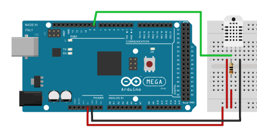
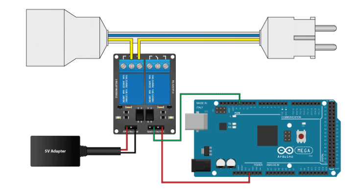
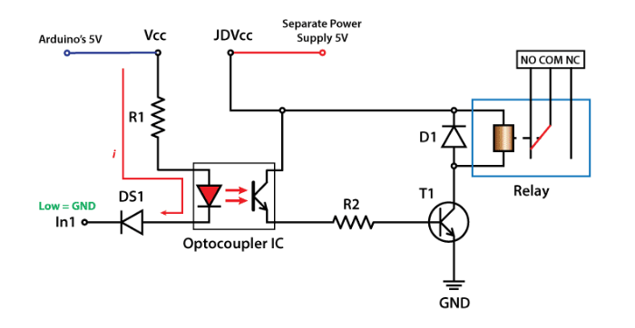
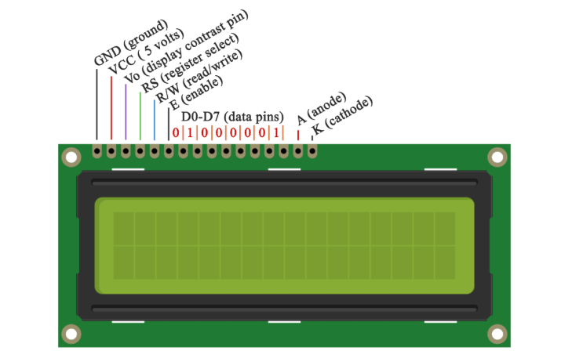
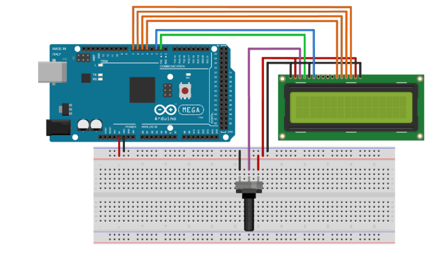
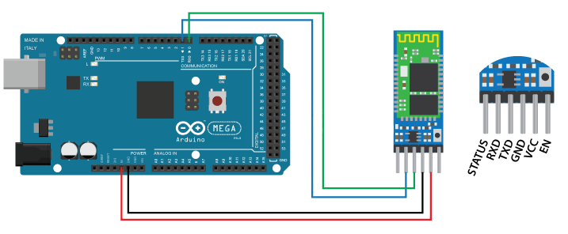

# Smart Fridge

## Description
The goal of this project is to fix my old fridge which has a broken temperature sensor. To achieve this we install a DHT22 sensor to measure the temperature in the fridge
and send the data to an arduino. If the current temperature is below the target we need to stop the current flow in order to turn off the fridge. In the opposite case
that the current temperature is above the target it means that we need to turn on the fridge. This is handled by the arduino board which uses the information 
from the DHT22 sensor to control the state of a relay which powers the fridge. An lcd panel displays the current temperature reading from the sensor, the state of 
the relay and the target temperature in order to ensure a smooth and user friendly experience. Finally, we also installed a HC-05 bluetooth module and develloped an android 
app in order to connect to the arduino with our phone and update the target temperature.

## How to connect the Arduino modules

### Connecting the DHT22 sensor (temperature sensor)
The DHTxx sensors have four pins, VCC, GND, data pin and a not connected pin which has no usage. A pull-up resistor from 5K to 10K Ohms is required to keep 
the data line high and in order to enable the communication between the sensor and the Arduino Board. There are some versions of these sensors that come with 
a breakout boards with built-in pull-up resistor and they have just 3 pins.

| DHT22         | Arduino       |
| ------------- | ------------- |
| VCC           | 5V            | 
| Data Pin      | Pin 8 in parrallel with 5k resistor and 5V (look at the picture)|
| GND           | GND           | 

### Connecting the relay (the "Fancy Switch")
Connect the Ground of the relay to the Ground of the arduino and use Pin 8 from arduino as the control input for the relay. It's a good practice to power the relay by an 
external 5V source but you can also use the 5V and ground of the arduino.

| Relay         | Arduino       |
| ------------- | ------------- |
| VCC           | 5V            | 
| In1           | Pin 12        | 

If you use an extension **meant for the EU**, like the one above but **with 3 wires** , make sure you use the wires coloured with a single colour.
The wire with 2 colours is meant to be used for Ground.

### Connecting the LCD
The LCD’s registers from D4 to D7 will be connected to Arduino’s digital pins from 4 to 7. The Enable pin will be connected to pin number 3 
and the RS pin will be connected to pin number 2. The R/W pin will be connected to Ground and the Vo pin will be connected to the potentiometer 
to adjust the contrast.

| LCD           | Arduino       |
| ------------- |-------------  |
| GND           | GND           | 
| VCC           | 5V            |
| Vo            | Potentiometer |
| RS            | Pin 2         |
| R/W           | GND           |
| Enable        | Pin 3         | 
| D4-D7         | Pins 4-7      | 
| A (Anode)     | 5V            | 
| K (Kathode)   | GND           | 

### Connecting the Bluetooth
We connect arduino's RX and TX pins to the TX and RX pins of the bluetooth module. Be careful with the pin names. If you connect RX to RX and TX to TX the arduino module
receive any data from the arduino.

| Bluetooth     | Arduino       |
| ------------- | ------------- |
| RX            | TX (Pin 1)    | 
| TX            | RX (Pin 0)    |  
| GND           | GND           | 
| 5V            | 5V            | 

## Changes in the code to use with your own Bluetooth module
You need to change the MAC address in the Kotlin code and use your own APK
* In the `FridgeControl.kt` and `LandingActivity.kt` change the `const val BLUETOOTH_FRIDGE: String = "00:21:13:00:79:72"` to the MAC address of your HC-05 module 
* Go to `Build` => `Build Bundle(s) / APK(s)` => `Build APK(s)`
* Install the APK you just built instead of the store app 

## Dependencies
- [DHTlib from RobTillaart](https://github.com/RobTillaart/Arduino/tree/master/libraries/DHTlib)

